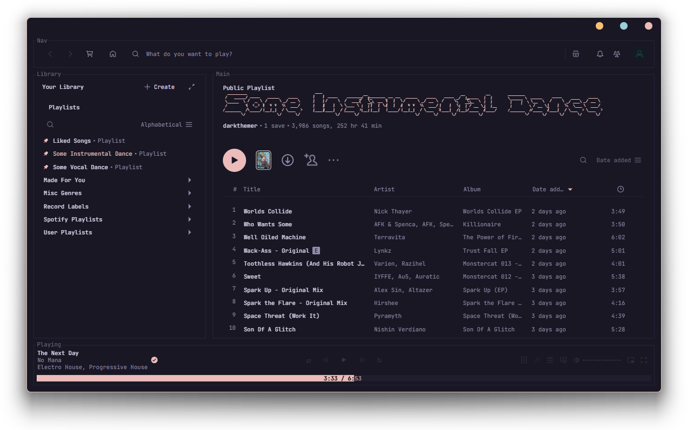

# rosepine-theme-windows

> All natural [pine](https://rosepinetheme.com/), faux fur and a bit of soho vibes for the classy minimalist.

### link to theme and icons:

[niivu - Rose Pine for Windows 11 22H2](https://www.deviantart.com/niivu/art/Rose-Pine-for-Windows-11-22H2-955213259)

### link to cursor:

[BIueGuy - Crystal Clear v4.1 | Original](https://www.deviantart.com/biueguy/art/Crystal-Clear-v4-1-Original-298678459)

### link to sound scheme:

[WindowsAesthetics - Aura II Sound Scheme](https://www.deviantart.com/windowsaesthetics/art/Aura-II-Sound-Scheme-708520612)

---

## Screenshots

### desktop

### caprine

### discord

### explorer

### firefox

### flowlauncher

### nomacs

### obsidian

### playnite

### spotify

### sumatrapdf

### thunderbird

### vscodium

