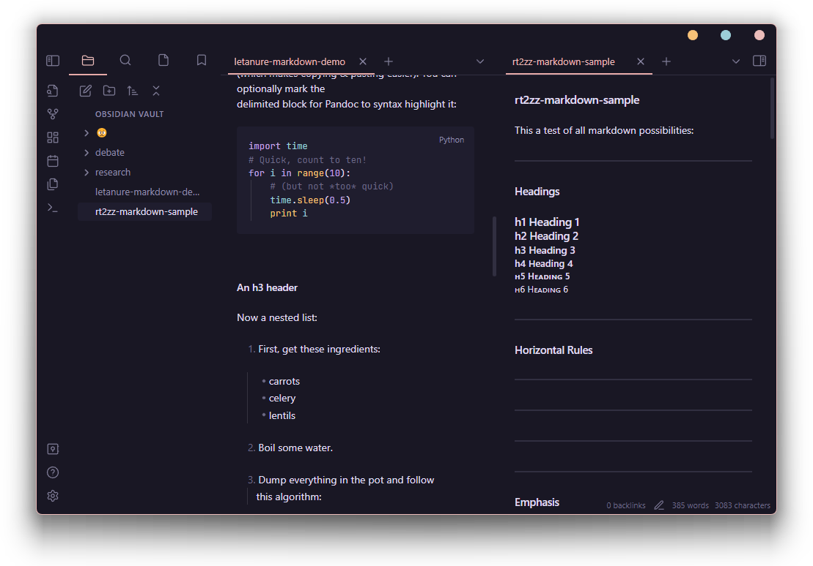
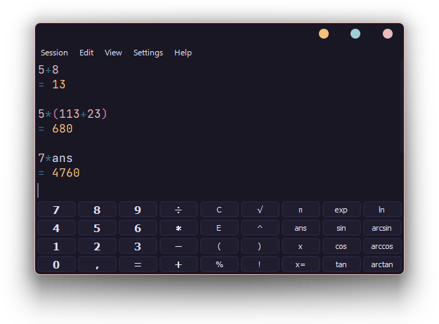
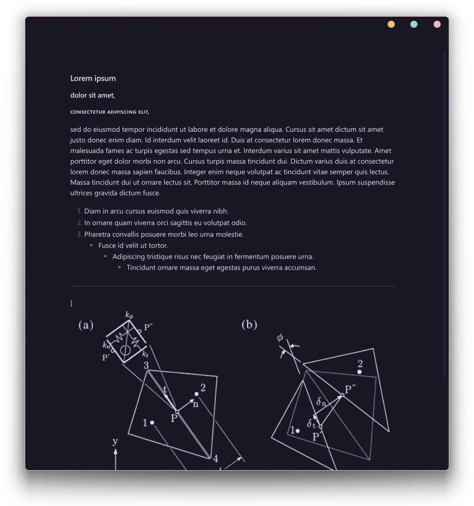
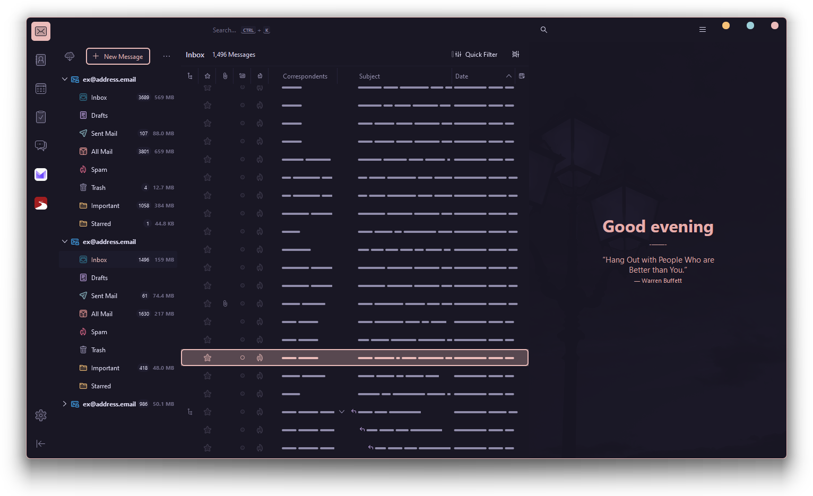
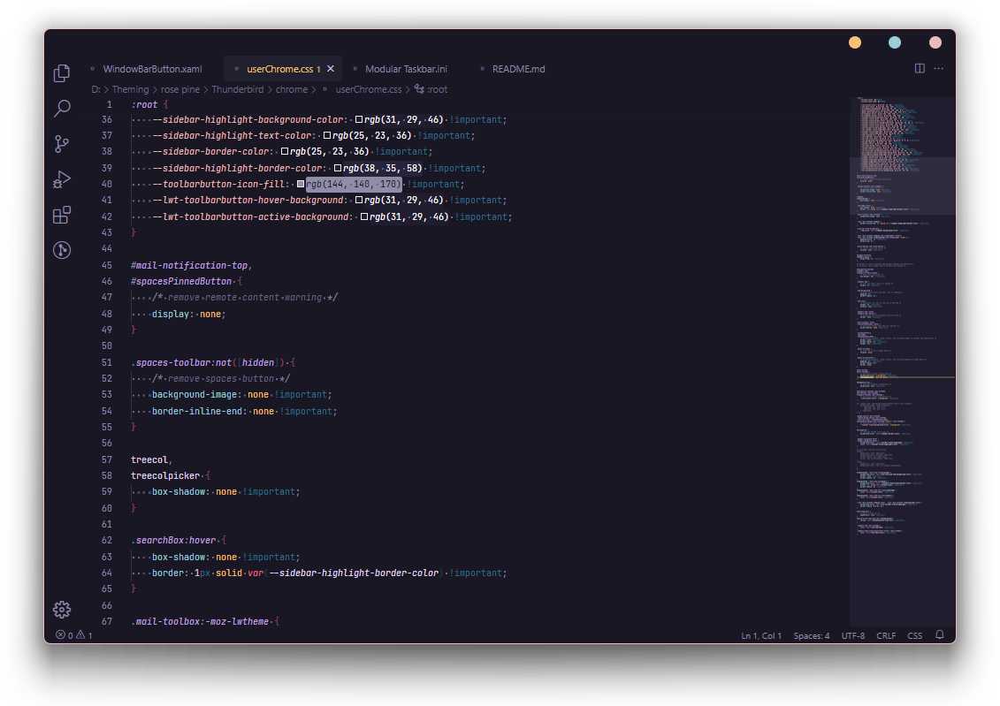

    
    <h2 align="center">rosepine-theme-windows</h2>

All natural pine, faux fur and a bit of soho vibes for the classy minimalist

## :art: visual style

[niivu - Rose Pine for Windows 11](https://www.deviantart.com/niivu/art/Rose-Pine-for-Windows-11-955213259)

## :bridge_at_night: icon pack

[niivu - Rose Pine Icon Theme](https://github.com/niivu/resource-redirect-icon-themes/blob/main/Resource%20Redirect%20themes/Rose%20Pine.zip)

## :fu: cursor

[BIueGuy - Crystal Clear v5 | Aero](https://www.deviantart.com/biueguy/art/Crystal-Clear-v5-Aero-298678459)

## :sound: sound scheme

[WindowsAesthetics - Aura II Sound Scheme](https://www.deviantart.com/windowsaesthetics/art/Aura-II-Sound-Scheme-708520612)

---

## Screenshots

### Desktop

### caprine

### discord

#### current

#### old

### explorer

### firefox

### flowLauncher

### jdownloader

### mpc-hc

### nomacs

### obs

### obsidian

### playnite

#### unmaintained

### qbittorrent

### sharex

### speedcrunch

### spotify

### steam

### sumatrapdf

### thunderbird

### vscodium

### windowsTerminal

